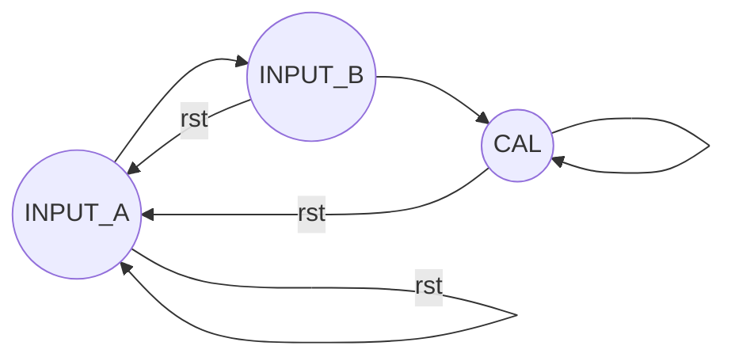

# Lab 1. 运算器及其应用


- 学号:PB21061373
- 姓名:刘兆宸
- 实验日期: 2022-3-15

[TOC]

## 实验题目

1. 算术逻辑单元（ALU）及测试
2. ALU应用：计算斐波那契—卢卡斯数列（FLS）

## 实验目的

- 掌握算术逻辑单元 (ALU) 的功能
- 掌握数据通路和控制器的设计方法
- 掌握组合电路和时序电路，以及参数化和结构化的 Verilog 描述方法
- 了解查看电路性能和资源使用情况

## 实验平台

- Xilinx Vivado v2019.1
- FPGAOL

## 实验过程

### ALU

```verilog
module alu #(   parameter WIDTH = 6)
 (
    input [WIDTH-1:0] a,
    input [WIDTH-1:0] b,
    input [3:0] func,
    output reg [WIDTH-1:0] y,
    output reg of
);

parameter ADD = 4'b0000;
parameter SUB = 4'b0001;
parameter BEQ = 4'b0010;
parameter U_LOW = 4'b0011; //无符号小于
parameter LOW = 4'b0100; //有符号小于
parameter AND = 4'b0101;
parameter OR = 4'b0110;
parameter XOR = 4'b0111;
parameter R_SHIFT = 4'b1000;
parameter L_SHIFT = 4'b1001;

always@(*)
begin
    case (func)
    //对于有符号数，如果相同符号的两个数相加或相减的结果与操作数的最高位不同，则会发生溢出；
        ADD:begin
           ..
        end
        SUB:begin
           ..
        end
        BEQ:begin
            ..
        end
        U_LOW:begin
            ..
        end
        LOW:begin
            ..
        end
        AND:begin
            ..
        end
        OR:begin
            ..
        end
        XOR:begin
            ..
        end
        L_SHIFT:begin
            ..
        end
        R_SHIFT:begin
            ..
        end
        default: begin
           ..
        end
    endcase
end
endmodule
```

#### 6 位操作数 ALU

 ALU 测试的数据通路如下：


#### 仿真

(VSCode有插件可以生成框架),仿真文件如下:

```verilog
//~ `New testbench
`timescale  1ns / 1ps
module tb_alu_test;
// alu_test Parameters
parameter PERIOD = 10;
parameter WIDTH  = 6;
parameter timesep = 20;
// alu_test Inputs
reg   clk                                  = 0 ;
reg   en                                   = 0 ;
reg   [1:0]  sel                           = 0 ;
reg   [5:0]  x                             = 0 ;
// alu_test Outputs
wire  [5:0]  y                             ;
wire  of                                   ;

initial
begin
    forever #(PERIOD/2)  clk=~clk;
end
alu_test #(.WIDTH ( WIDTH ))  u_alu_test1 (
    .clk                     ( clk        ),
    .en                      ( en         ),
    .sel                     ( sel  [1:0] ),
    .x                       ( x    [5:0] ),

    .y                       ( y    [5:0] ),
    .of                      ( of         )
);
initial begin
        clk = 1'b0;
        en = 1'b0;
        sel = 2'b11; //不输入
        x = 6'h00; //
        #(timesep)
        en = 1'b1;
        sel = 2'b00 ;  //input a =3
        x = 6'h03 ;
        #(timesep)
        sel = 2'b01;  // input b = 2
        x = 6'h02;
        #(timesep)
        sel = 2'b10;   //func =0000 ADD
        x = 6'h00;
        #(timesep)
        sel = 2'b10;   //func =0001 SUB
        x = 6'h01;
        #(timesep)
        sel = 2'b10;
        x = 6'h05;    //func =0101 AND
        #(timesep)
        sel = 2'b10;
        x = 6'h06;   //func =0110 OR
        #(timesep)
        $finish;
    end
endmodule
```

仿真结果如下:
..
分析:  此处输入a=3,b=2  

- func=00 ->ADD : Answer = 5 :ok:
- func=01 -> SUB: Answer = 1  :ok:
- func=05 -> &: Answer = 2  :ok:
- func=06 -> |: Answer = 3  :ok:

再来一组

```verilog
initial begin
        clk = 1'b0;
        en = 1'b0;
        sel = 2'b11; //不输入
        x = 6'h00; //
        #(timesep)
        en = 1'b1;
        sel = 2'b00 ;  //input a = 16+5=21  10101
        x = 6'h15 ;
        #(timesep)
        sel = 2'b01;  // input b =  16+6=22  10110
        x = 6'h16;
        #(timesep)
        sel = 2'b10;   //func =0000 ADD
        x = 6'h00;
        #(timesep)
        sel = 2'b10;   //func =0001 SUB
        x = 6'h01;
        #(timesep)
        sel = 2'b10;
        x = 6'h05;    //func =0101 AND
        #(timesep)
        sel = 2'b10;
        x = 6'h06;   //func =0110 OR
        #(timesep)
        $finish;
    end
```


这组数据

十进制a = 16+5=#21  二进制:`10101 `   16进制:15

​     b =  16+6=#22      `10110`    16进制:16

a+b 溢出了 of=1 ，结果是2b  :ok: 

a-b = -1 = 111111    `16进制:3f   :ok:

a&b = 10100  16进制:14  :ok:

a|b = 10111  16进制:17 :ok:   

#### 综合RTL电路

..

### FLS

#### 状态转换图



Input_A: 输入A,同时为初始(复位)状态.a<=x

Input_b: 输入F  f<=x

CAL:   **f(k+1)=ALU(f(k),f(k-1),oprand)**   ,k++  且fun<=x(对x分时复用)

实现方式:tmp< =a ; a< =f   f < = ALU(tmp,f,func)  

#### 数据通路

...
相关代码:

```shell
#结构
│─ tb.v
└─new
	└─ alu.v
     ─fls.v
     ─fsm.v
```

```verilog
module fsm(
    input clk,
    input rst,
    input en,
    output [1:0] state
);
    reg [1:0] curr_state;
    reg [1:0] next_state;
    //编码
    parameter INPUT_A = 2'b00;//也为INIT状态
    parameter INPUT_B = 2'b01;
    parameter CAL = 2'b10;

    //Part 1: state transfer// 描述CS
    always @(posedge clk) begin
        if (rst) curr_state <= INPUT_A;
        else if (en) curr_state <= next_state;
    end

    //Part 2: next state // 描述NS
    always @( * ) begin
        case (curr_state)
            INPUT_A: next_state = INPUT_B;
            INPUT_B: next_state = CAL ;
            CAL: next_state = CAL ;
            default: next_state = INPUT_A;
        endcase
    end
    // FSM Part 3: output logic and state action //描述输出
    assign state = curr_state;
endmodule
```


#### 仿真

仿真文件如下:

```verilog
//~ `New testbench
`timescale  1ns / 1ps

module tb_fls;

// fls Parameters
parameter PERIOD   = 10   ;
parameter INPUT_A  = 2'b00;
parameter INPUT_F  = 2'b01;
parameter CAL      = 2'b10;

// fls Inputs
reg   clk                                  = 0 ;
reg   rst                                  = 0 ;
reg   en                                   = 0 ;
reg   [6:0]  d                             = 0 ;
// fls Outputs

wire[6:0] f                           ;

initial
begin
    forever #(PERIOD/2)  clk=~clk;
end

initial
begin
    #(PERIOD*2) rst  =  0;
end

fls #(
    .INPUT_A ( INPUT_A ),
    .INPUT_F ( INPUT_F ),
    .CAL     ( CAL     ))
 u_fls (
    .clk                     ( clk               ),
    .rst                     ( rst               ),
    .en                      ( en                ),
    .d                       ( d         ),
    .f                      ( f        )
);

initial
begin
    rst = 1 ;
    en  = 0 ;
    d   = 2 ;   // a1=2
    #(PERIOD)      
    rst = 0 ;
    en  = 1 ;
    #(PERIOD*3)
    en = 0  ;
    d  = 3  ;   // a2 = 3
    #(PERIOD*2)
    en = 1  ;
    #(PERIOD*3)
    en = 0  ;
    d  = 0  ;   //d=0对应 ALU :ADD  a3=5
    #(PERIOD*2)
    en = 1  ;
    #(PERIOD*3)
    en = 0  ;
    d  = 0  ;    //ADD    a4 =8
    #(PERIOD*3)
    en = 1   ;
    #(PERIOD*3)
    en = 0  ;
    d  = 1  ;   //  SUB  a5=3
    #(PERIOD*3)
    en = 1  ;
    #(PERIOD*3)
    en = 0  ;
    #(PERIOD*3)   //SUB   a6 = -5  0x7b
    en = 1  ;
    #(PERIOD*3)   
    en = 0  ;
    #(PERIOD*3)   //AND   a7 = -5 & 3    1111011 &  0000011 =3
    en = 1  ;
    d  = 5  ;     
    #(PERIOD*3)   
    en = 0  ;
    #(PERIOD*3)   //OR   a8 = 3 & -5    1111011 &  0000011 =0x7b
    en = 1  ;
    d  = 5  ;     
    #(PERIOD*3)   
    en = 0  ;
    $finish;
end

endmodule
```

仿真结果如下:

...

分析:

f=2 输入a1=，2 f=3 输入a2=3,之后rst=0,f后一直进行迭代,即 $a_{n+1}=ALU(a_n,a_{n-1},func)$,每次按button可以调节func来控制$a_{n+1}$的输出.(对输入d进行分时复用,a,f,func都可通过d进行调节,即在输入前两项之后，任何时刻在输出下一项之前，都可以通过开关修改 ALU 的工作模式。)

// a1=2

// a2 = 3

//d=0对应 ALU :ADD  a3=5

//d=0 ADD    a4 =8

//d=1  SUB  a5=3

//     SUB  a6 = -5  0x7b

//d=5  AND   a7 = -5 & 3    1111011 &  0000011 =3

:ok:结果正确

#### 综合
..

## 实验总结

这次实验任务量适中.设计ALU部分原理较为简单,这次主要还是练习了测试与应用ALU的部分,让我熟练了FSM的步骤和测试,仿真文件的编写.

1. 常见的按钮需要取边缘操作一开始走了弯路,后面规范将4个状态(本来Input_A前还有个Init状态发现可以合并)减少为三个状态让状态转换更为清晰.
2. 一些细节如parameter在不同文件需要重复定义(仿真文件忘记改折磨半天:cry:)
3. 对于模块传入参数的编写还不太熟练


