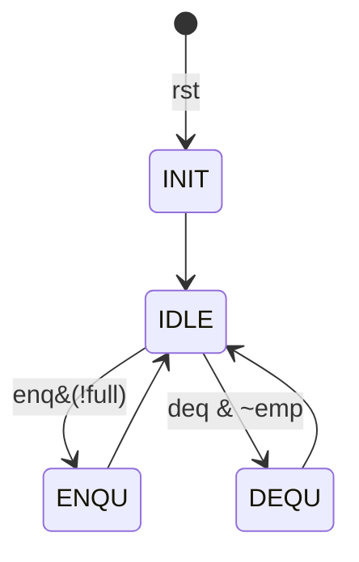

[TOC]

# 实验二 寄存器堆与队列

- 学号: PB21061373
- 姓名:刘兆宸
- 实验日期: 2022-4-10

## 实验目标

1. 实现寄存器堆
2. 熟悉分布式内存和块内存 IP 核的使用
3. 实现 FIFO

## 实验内容

### 寄存器堆

注意到 Verilog 允许端口作数组索引，在 `always` 块中用一数组存储即可。

仿真如下：
..


### 内存 IP 核

使用 Vivado 内置的内存 IP 核，例化进行读写操作。

分布式与块式仿真如下：


Read 模式下dist是异步读,block是同步读


由上述两张仿真图可知,

#### 块式的几个参数选择


> Operating Mode：RAM读写操作模式。共分为三种模式，分别是Write First（写优先模式）、Read First（读优先模式）和No Change（不变模式）。
>
> - 写优先模式指数据先写入RAM中，然后在下一个时钟输出该数据；
>
> - 读优先模式指数据先写入RAM中，同时输出RAM中同地址的上一次数据；
>
> - 不变模式指读写分开操作，不能同时进行读写。

如图read_first和write_first模式下,read_first会先读出原来RAM中的数据,下一个周期才写入数据,而w模式则会在第一个posedge就写入.而nochange模式因为一直可读故无法写入RAM.

primitive_out和core_out模式相较之下会延后一个周期,而开启both则会延后两个周期.

### FIFO

#### 状态图



#### 数据通路

..

#### 综合电路


#### Top模块

```verilog
module fifo (input clk,
             rst,               //时钟（上升沿有效）、同步复位（高电平有效）
             input enq,         //入队列使能，高电平有效
             input [3:0] in,    //入队列数据
             input mode ,       //sw[4] ,附加
             input deq,         //出队列使能，高电平有效
             output [3:0] out,  //出队列数据
             output full,
             empty,             //队列满和空标志
             output [2:0] an,   //数码管选择
             output [3:0] seg); //数码管数据
    
    wire        enq_edge;
    wire        deq_edge;
    wire        we;
    wire [2:0]  ra0, ra1, wa;
    wire [3:0]  rd0, rd1, wd;
    wire [7:0]  valid;
    wire [2:0]  shifter;

    sig_edge SEDG_enq(
    .clk(clk),
    .a  (enq),
    .p  (enq_edge)
    );
    sig_edge SEDG_deq(
    .clk(clk),
    .a  (deq),
    .p  (deq_edge)
    );
    reg_file RF(
    .clk(clk),
    .ra0(ra0),
    .ra1(ra1),
    .we (we),
    .wa (wa),
    .wd (wd),
    .rd0(rd0),
    .rd1(rd1)
    );
    
    LCU lcu(
    .clk  (clk),
    .rst  (rst),
    .in   (in),
    .enq  (enq_edge),
    .deq  (deq_edge),
    .rd   (rd0),
    .full (full),
    .emp  (empty),
    .out  (out),
    .ra   (ra0),
    .we   (we),
    .wa   (wa),
    .wd   (wd),
    .valid(valid),
    .mode(mode),
    .shifter(shifter)
    );
    
    segplay SDU(
    .clk_100mhz  (clk),
    .data        (rd1),
    .valid       (valid),
    .addr        (ra1),
    .segplay_an  (an),
    .segplay_data(seg),
    .shifter     (shifter)
    );
endmodule

```

#### Regfile

同Part1，这里寄存器堆起到存储传输作用.


#### 出入队使能信号处理Get_Edge

**异步信号同步+取边沿**

异步信号不同步时，可能会导致时序问题和稳态问题(如毛刺),因此需要对异步信号进行同步化处理，对button只需取边沿获取一次信号,这里采用3级触发器完成信号同步与取边沿操作:

```verilog
    always @(posedge clk) begin
        st <= a;
        s_reg <= st;
        pt <= s_reg;
    end
    assign s = s_reg;
    assign p = s_reg & ~pt;  
```


#### 数码管显示SDU

[参考vlab文档-FPGAOL 七段数码管使用说明](https://git.ustc.edu.cn/hexuustc/fpgaol-examples#%E4%B8%83%E6%AE%B5%E6%95%B0%E7%A0%81%E7%AE%A1)

> 1.仅使能由`AN[2:0]`所表示的二进制数所对应的数位；在显示的数字方面，不再通过`SEG`信号独立控制每个段（segment），而是直接显示`D[3:0]`形成的16进制数。**例如**，若`AN=3'b010, D=4'b1010`，则在下标为2的数位上显示`A`。

> 2.和现实中的数码管一样，我们建议的扫描频率为**50Hz**，也就是说，若要驱动8个数码管，需要一个**400Hz**的时钟。

```verilog
    reg [17:0] clk_cnt;   
    assign clk_400hz = ~(|clk_cnt);     // clk_400hz = (clk_cnt == 0)脉冲
    always @(posedge clk_100mhz) begin
        if (clk_cnt >= 249999) begin // 100M Hz/400 Hz/2 -1
            clk_cnt <= 0;
            addr    <= addr + 1;
            end 
            else
            clk_cnt <= clk_cnt + 1;
    end
    reg [2:0] segplay_an_reg;
    reg [3:0] segplay_data_reg;
    always @(posedge clk_100mhz) begin
        if (clk_400hz && valid[addr]) begin
            segplay_an_reg   <= addr;
            segplay_data_reg <= data;
        end
    end

    assign segplay_data = (|valid) ? segplay_data_reg : 4'h0;
    assign segplay_an   = (|valid) ? segplay_an_reg - shifter  : 3'h0;    
```

附加2: 为了控制显示在最右端,只需要将位数设为`segplay_an-head(shifter)`即可.

#### 控制单元LDU

LDU负责很重要的部分包括各个信号(如下)的生成,状态的转移与调控.  

```verilog
//重要的signal，

//full = 1 < = >valid[i] = 1, for i in range(0,8)
    assign full= 
  
    assign emp =
    
    assign ra = 
    
    assign we =  
    
    assign wa = 
   
    assign wd = 
   //为了保障能在最右端输出的数码管移位数
    assign shifter
```

状态机三段式

```verilog
   //Part 1: state transfer// 描述CS
    always @(posedge clk) begin
        if (rst) curr_state <= INIT;
        else  curr_state    <= next_state;
    end
    
    //Part 2: next state // 描述NS
    always @(*) begin
            if (enq & ~full)
            begin
                next_state = ENQU;
            end
            else if (deq & ~emp)begin
                next_state = DEQU;
            end
                else next_state = IDLE;
                end
// FSM Part 3: output logic and state action //描述输出    
    always @(posedge clk) begin
            if(mode==1)  out <= ram_data;
            casez (curr_state)
                INIT:
                begin
                    valid <= 8'h00;
                    head  <= 3'h0;
                    tail  <= 3'h0;
                    out  <= 3'h0;
                end
                ENQU:
                begin
                    valid[tail] <= 1'b1;
                    tail        <= tail + 3'h1;
                end

                DEQU:
                begin
                    valid[head] <= 1'b0;
                    head        <= head + 3'h1;
                    if(mode==0) out         <= rd; 
                end
            endcase
        end
```


## 实验总结

1.本次实验实现了寄存器堆及其应用,几种RAM的例化,为数据传输与存储奠定了基础

2.注意异步信号同步化与取边缘的技巧

3.熟悉了外设seg_play的使用

### 附:

源文件

```shell
│  regfile.v
│
├─fifo
│      get_edge.v   
│      LCU.v
│      regfile.v
│      segplay.v
│      top.v
│
└─ip_core
        tb_blk.v    //Block的参数与模式选择
        tb_dis.v    //比较distribuive和Block
```

