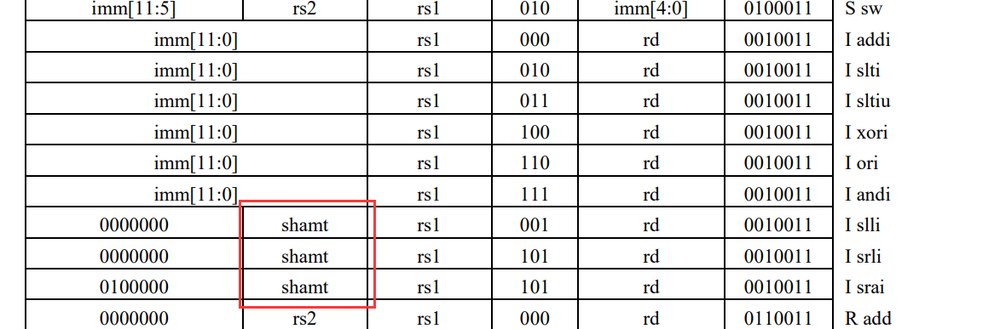
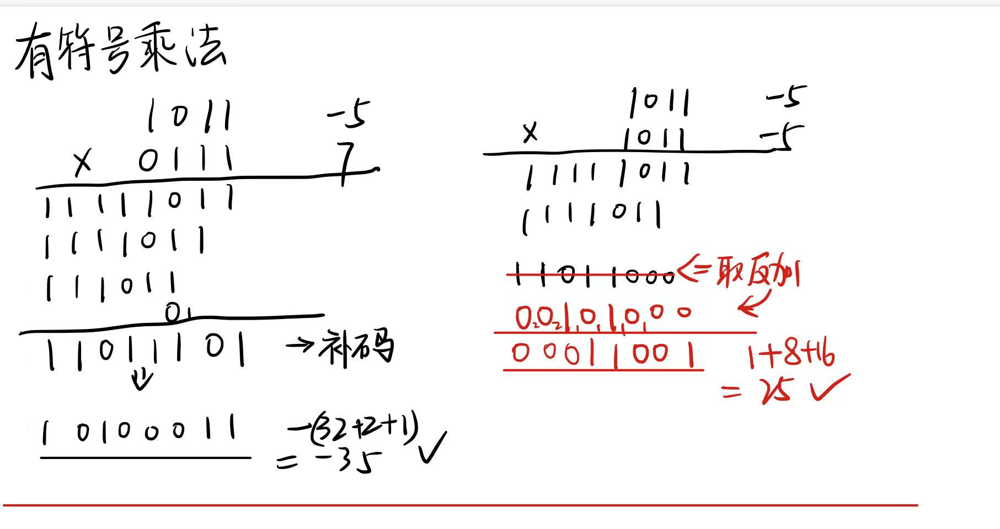
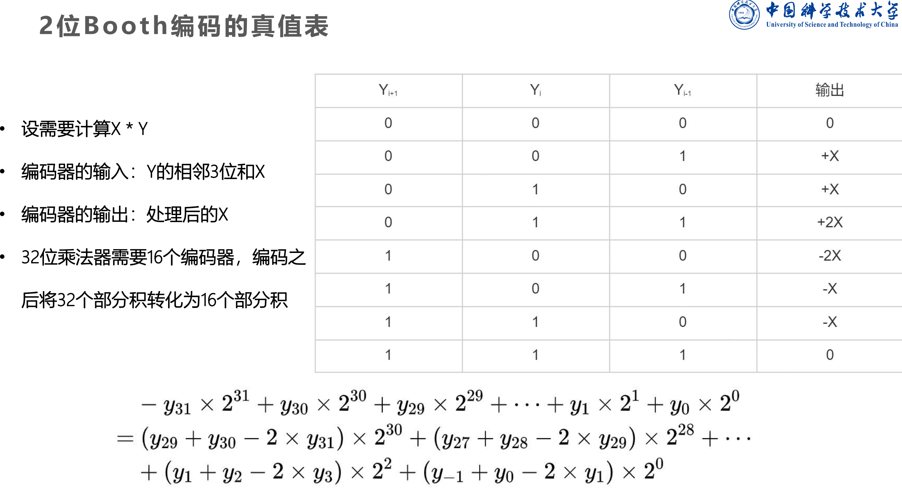
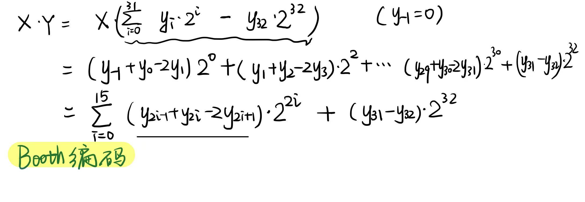
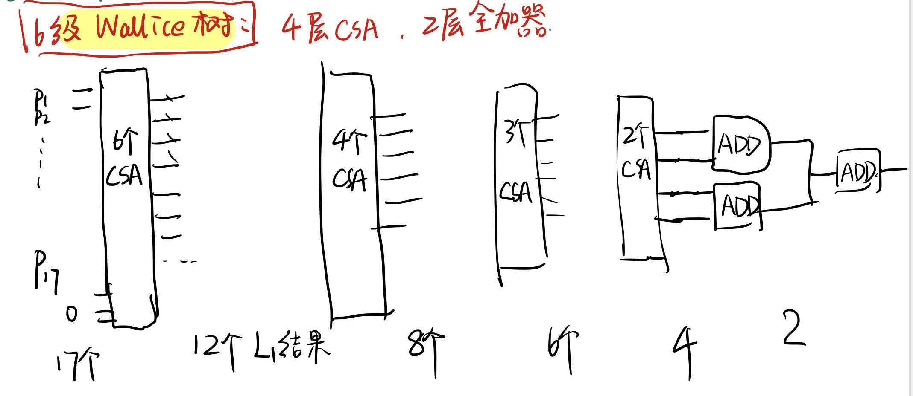
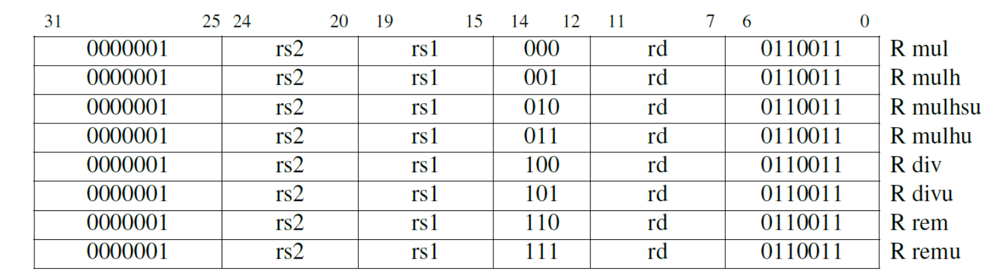
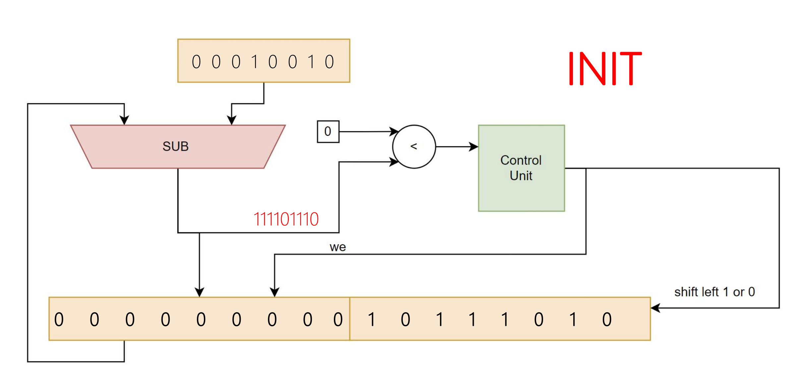

# Lab 6 综合实验--拓展流水线


## 指令集拓展

### 逻辑与分支指令

B型6种beq,bne,blt,bge,bltu,bgeu,多拓展br_type一位然后分case处理即可

S型 slt,slti,sltu,sltiu ,应对这类指令创建一个单元 slt_unit 处理,逻辑如下

```verilog
    always@(*)begin
    case (slt_type)
        SLT : slt_src = ($signed(op1) < $signed(op2))?1:0; //slt
        SLTU : slt_src = (op1<op2)?1:0;//sltu
        SLTI : slt_src = ($signed(op1) < $signed(op2))?1:0; //slti
        SLTIU : slt_src = (op1<op2)?1:0;//sltiu
        default: slt_src=0;
    endcase
    end
```

数据通路增加：Control多生成slt,slt_type信号,在ex阶段增加slt_unit,生成slt_src(给imm发信号是0或1),wb_sel对应选择imm.

### 算数与逻辑指令

Control生成相应信号,功能在ALU中实现即可

ALU大部分功能在lab1中已完成,增加了功能

```verilog
localparam R_SHIFT_ARI = 4'b1011;//算数右移
R_SHIFT_ARI:begin
           y = $signed(a) >>> b;//需要符号拓展
              of = 0;
        end
```


srai指令这里有个坑,出在imm模块,其它I型指令立即数直接取高12位,但是srai来说就会出错应该是取inst[24:20],如下图所示




### 访存指令

先观察lw的数据通路

lw,lb,lh,lbu,lhu的load类型opcode 都是一样的,只是funct3 不一样,于是我们在wb阶段加一个解析器load_parse(mem阶段延时已经够大)对读出来的数据进行处理即可.

sw,sb,sh的opcode也是一样,在ex阶段加一个解析器即可.

以load_parse为例,代码如下:

```verilog
module load_parse(input [31:0] mem_rd,
                  input [31:0] inst,
                  input [1:0] offset,             //取mem_addr[1:0]做偏移量offset
                  output reg [31:0] parsed_data);
    
    wire [2:0]funct3;
    assign funct3 = inst[14:12];
    always @* begin
        case (funct3)
            // lb 指令
            3'b000:
            begin
                case (offset)
                    2'b00: parsed_data = {{25{mem_rd[7]}}, mem_rd[6:0]};
                    2'b01: parsed_data = {{25{mem_rd[15]}}, mem_rd[14:8]};
                    2'b10: parsed_data = {{25{mem_rd[23]}}, mem_rd[22:16]};
                    2'b11: parsed_data = {{25{mem_rd[31]}}, mem_rd[30:24]};
                endcase
            end
            // lh 指令
            3'b001:
            ...
            
            // lw 指令，直接返回读取的 32 位数据
            3'b010: parsed_data = mem_rd;
            
            // lbu 指令，将低 8 位零扩展为 32 位
            3'b100:
           ...
            
            // lhu 指令，将低 16 位零扩展为 32 位
            3'b101:
            begin
                case (offset)
                    2'b00: parsed_data = {16'b0, mem_rd[15:0]};
                    2'b01: parsed_data = {16'b0, mem_rd[23:8]};
                    2'b10: parsed_data = {16'b0, mem_rd[31:16]};
                    default parsed_data = 0;
                endcase
            end
            default: parsed_data = 32'd0;
        endcase
    end
endmodule
```

### 必做遇到的其它bug

- 晕,超过了256指令貌似出问题了,指令直接读错了(这里查了挺久:cry:),所以得把IM换成深度512的ROM,并且改相应的mem_addr位宽

- 还有就是沈助教在群里说的那个load-use冒险的修改也查了我一晚上才发现

## 有符号乘法器设计

无符号数可进行高位补0的符号拓展转换成33位有符号数的乘法,故只需设计一个33位有符号乘法器

> 符号问题真的容易出bug!!!

### 基本原理

见下面这张图,$设a*b ,b第i位为b_i,$则if $b_{32}=0, a*b =\sum_i^{31} a*b_i*2^i$，与a为正数或是负数无关,但是如果b是负数即b^32=1 貌似就不对了

但是此时有个很妙的统一化的方式$a*b= \sum_i^{31} a*b_i*2^i-a*b_{32}*2^{32}$,虽然我们之前对负数补码操作常用的都是取反加1,但是别忘了它定义是怎么来的. 



按照上面的思路,可以转化成33个有符号数(称作部分积)相加.(b[i]如果是0就是0,否则就是A<<i再符号拓展)

```verilog
genvar j;
generate
    for (j = 0; j < 66; j = j + 1) begin
    assign tmp = A << j;
    assign p[j] = B[j] ? {{(34-j){tmp[32+j]}}, tmp[31+j:0]} : 66'b0;
    end     
endgenerate
```

但是这样还是有33个加数相加,我们可以使用booth算法将加数减半成17个.

### booth算法

对$A=\sum_{i=0}^{31}a_i2^i$,用booth编码能只保留2的偶数次幂

//Booth 编码是一种针对二进制补码的乘法算法，可以将乘法操作数进行编码，从而减少部分积的个数。




对于33位乘法,由于是奇数位最后一位有点特别（单独处理）,编码如下:



由booth 编码和上面的真值表可以生成17个部分积,只需将它们相加.利用保留进位加法器(CSA)和伪华莱士树

容易出bug的地方

- (这里对x,-x处理要小心,比如a是负数一开始就没有考虑清楚)!
- booth算法的系数正确性,自己检验后才可以

### CSA

• 保留进位加法器（CSA）在多位宽加法情况下，没有引入位间的串行延迟，代价是其并不能算 出真正的和，但可以把加数个数缩减为原来的2/3 

• 如果要真的算出几个数的和，通过多层保留进位加法器后，最后仍然需要一个全加器来计算

CSA实现很简单:

```verilog
    assign S = A ^ B ^ cin;
    assign cout = (A & B) | (A & cin) | (B & cin);
//但是cout不是保留进位的真正结果真正结果应该是 res = cout<<1;//这里容易出bug
```


### Wallice树

华莱士树结构如下:




但是估计最后两级全加器延时比前四级还要高(?maybe)


至此有符号乘法器已经完成,下面试着将其加入流水线中.


### 流水化

将乘法分为两级:第一级解析乘法指令并进行booth编码(在id阶段),第二级在ex阶段跑"华莱士树",然后解析66位结果转化成64位

数据通路: Control生成 信号 mul_id , mul_type 




#### New Hazard!   

但是有个问题,这样会产生新的冒险.因为id阶段就需要读取数据.比如测试样例中的:

```assembly
    #li相当于lui+addi
    li a0, 0x12345678
    li a1, 0x87654321
    
    mul a2, a0, a1
    mul a3, a0, a2
```


解决方法是把上一条指令的EX或者WB结果前递传给下一级的id阶段,这需要修改Hazard模块

```verilog
// id前递相关,mul专用
always @(*) begin
    rf_rd0_fe_id = 1'b0;
    rf_rd1_fe_id = 1'b0;
    //先考虑较近的前递
    if (rf_we_ex && mux_id&& (rf_ra0_id != 0) && ( rf_ra0_id == rf_wa_ex) && (rf_wd_sel_ex !=2'b10))
    begin
        rf_rd0_fe_id = 1'b1;
        rf_rd0_fd_id = alu_ans_ex;
     end
     else if(rf_we_mem && mux_id && (rf_ra0_id != 0) && (rf_ra0_id == rf_wa_mem)&& (rf_wd_sel_mem !=2'b10))
     begin
        rf_rd0_fe_id = 1'b1;
        rf_rd0_fd_id =alu_ans_mem;
     end
    ...
end
```


## Radix-2移位除法器

### 基本原理

-  符号处理：在开始除法前，将符号记录下来，并把所有源操作数转换为其绝对值，除法完成后再变换 操作数的正负性

-  将无符号除数和被除数交给一个DIV_unit控制单元通过32次左移QR寄存器得到Q(uotient)和R(emainder).

- 一些例子: -80/30 = -2 ...-20  ,80/-30= -2 ...20 ,-80/-30 =2... -20

### 控制单元原理

不断试余数和除数差（一直假设在商的位置上写1）如果 差小于0，那么这一位商为0，需要左移RQ寄存器，再看下一位。如果差大于0，那么把差的低32位放到RQ寄存 器的高32位，并将剩余所有低位左移，低位补1.



```verilog
 RQ_reg = { 32'b0,dividend}; // 将被除数放入寄存器低位
      quotient_reg = 0;            // 初始化商为0
      i = 0;
      j=  0;                       // 初始化循环计数器为0
      while (i<32) begin
        if (RQ_reg[63:32] >= divisor) begin
          RQ_reg = RQ_reg - {divisor, 32'b0}; // 余数减去除数
          RQ_reg[0] = 1;                 // 当前位商置1
        end
        RQ_reg = RQ_reg << 1;                  // 余数左移1位
        j = i + 1;                             // 计数器加1
        i=  j;                                  
      end
      if (RQ_reg[63:32] >= divisor) begin
          RQ_reg = RQ_reg - {divisor, 32'b0}; // 余数减去除数
          RQ_reg[0] = 1;                 // 当前位商置1
        end
```

### 流水化

mul和div指令都是R性指令,只是头7变成了0000001,在mul设计中已完成了ISA的解析,所以直接将除法器接入ex阶段,信号生成和mul类似，封装性较好。所以这块做的很快.


